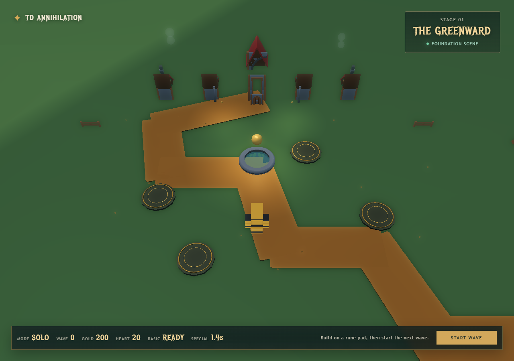
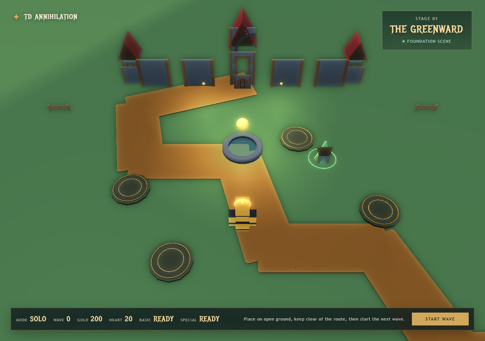
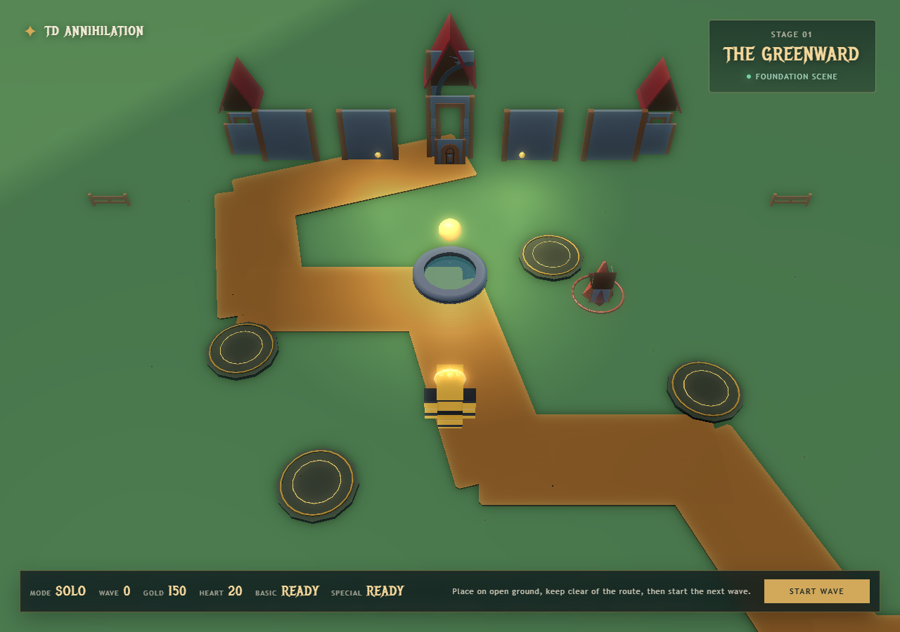
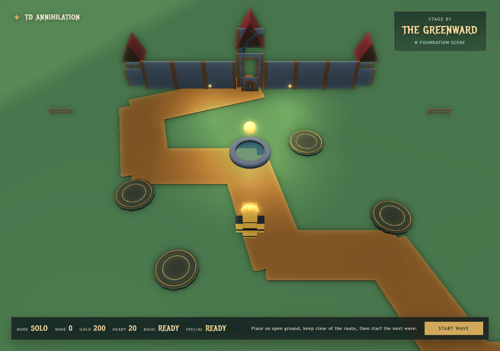

# Greenward — före och efter

Det här är en konkret visuell jämförelse av verkliga webbläsarsessioner. **Före** visar den tidigare spelbara versionen före freeform-bygge och slottsrebuilden; **efter** visar samma 1280×900-standardkamera efter ändringarna. Bilderna är sparade här i repot så nästa session kan kontrollera påståendena utan att återanvända osynlig historik.

## 1. Bygga torn

| Före — fast rune pad | Efter — fri placering med förhandsvisning |
| --- | --- |
|  |  |
| HUD säger **“Build on a rune pad”** och det placerade tornet står i en fast cirkel. | En transparent grön tornsilhuett och ring följer markpekaren. Grönt betyder giltig fri mark; rött används på väg, vatten, stenar, strukturer och utanför kartan. |

Den andra efterbilden visar ett faktiskt klick i samma session: tornet finns på fri mark och guld har minskat från 200 till 150. Rune-pads finns kvar som dekor och rumsmarkörer, men styr inte längre placeringen.

## 2. Slottets silhuett

| Före — fristående delar | Efter — sammanfogad fästning |
| --- | --- |
|  |  |
| Bakgrunden består av separata hustak och väggbitar med stora mellanrum. Den läser inte som ett slott eller ett mål för vägen. | En obruten mur löper in i ett centralt porttorn med synlig dörr och flankeras av två torn. Vägen slutar visuellt vid porten, vilket ger kartan en tydlig försvarspunkt. |

## Vad jämförelsen bevisar

- Byggsystemet har gått från **fem fasta platser** till **fri men begränsad markplacering**. Avstånd mellan torn, avstånd till vägen, kartgränser och guld är fortfarande obligatoriska begränsningar.
- Slottet har gått från en rad lösa rekvisita till en läsbar fästningssilhuett byggd av Kenney Fantasy Town Kit-delar.
- Alla fyra bilder kommer från riktiga spelkörningar. De visuella efterbilderna kontrollerades efter den senaste koden; webbläsarkonsolen rapporterade 0 fel och 0 varningar.

Relaterad krav- och teststatus finns i [PROJECT_STATUS.md](../../PROJECT_STATUS.md).